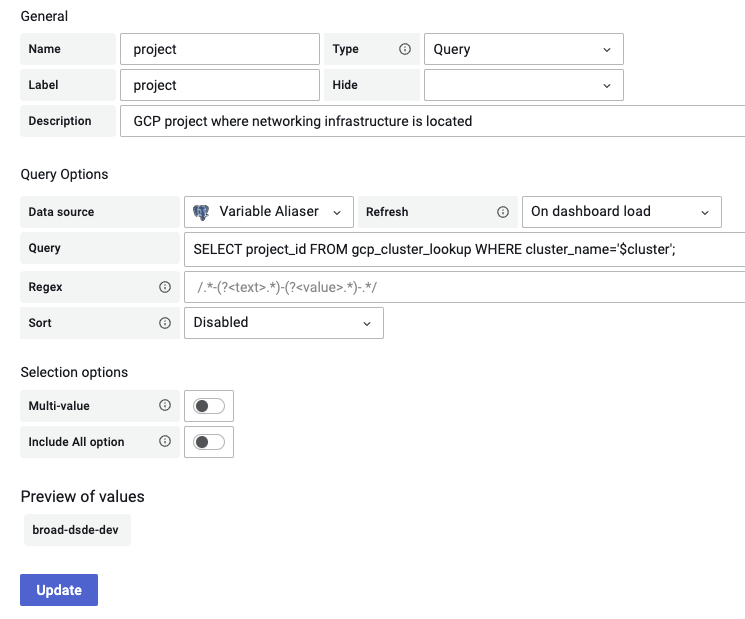
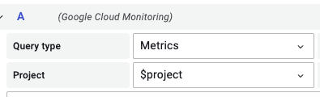

# grafana-variable-aliaser
## It maintains lookup tables to help alias variables in Grafana dashboards

More specifically, this script is meant to maintain a Postgres DB that can be used as a datasource in Grafana.

Then, the datasource can be queried from variable declarations to do a lookup/mapping, like described on [Grafana's blog](https://grafana.com/blog/2019/07/17/ask-us-anything-how-to-alias-dashboard-variables-in-grafana-in-sql/).

What's supported:

- Google Cloud Platform:
  - Table `gcp_cluster_lookup`
    - Primary key `cluster_name`, like 'terra-dev'
    - `cluster_location`, like 'us-central1-a'
    - `project_id`, like 'broad-dsde-dev'
    - `project_display_name`, like 'DSDE Development'
    - `project_api_name`, like 'projects/806222273987'
  - Table `gcp_project_lookup`
    - Primary key `project_id`, like 'broad-dsde-dev'
    - `project_display_name`, like 'DSDE Development'
    - `project_api_name`, like 'projects/806222273987'

You'll need to create the tables manually.

### How do you use it?

Assuming the database this script maintains is properly added as a Grafana datasource, like this:

Assuming you have `$cluster` as a variable with the name of the Kubernetes cluster, the above will create a `$project` variable always containing the corresponding project ID.

This is super useful for grabbing GCP metrics associated with your cluster:

### Normal README stuff

This is Python 3.9+. I used a venv that PyCharm gave me but it shouldn't really matter, there's a `requirements.txt`.

There's no CLI arguments, environment variables are given at the top of `main.py`.
